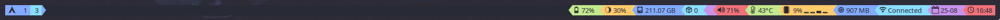

# Colorbar
A colorful polybar config for my laptop "moon"

  

The main bar config can be found at `polybar/config`. Modules are configured in a separate file at `polybar/modules.config`. Finally, custom module scripts are located at `polybar/modules`.

Note: The main config for the bar is set to use xrdb values by default. Look at the `colors` section.

## Modules
- Arrows: Powerline arrows used to separate modules
  - arrow-end
  - arrow2
  - arrow-yellow
  - arrow-blue
  - arrow-cyan
  - arrow-magenta
  - arrow-red
  - arrow-green

- Normal modules
  - arch-icon
  - bspwm
  - battery
  - brightness
  - filesystem
  - pulseaudio
  - temperature
  - cpu
  - memory
  - wifi-moon
  - date
  - time

- Custom modules
   - updates-arch-aur* Uses a custom script from my dotfiles (`yaysync`)
   - cmus
   - spotify
   - nvidia-smi
   - amdgpu
   
        

